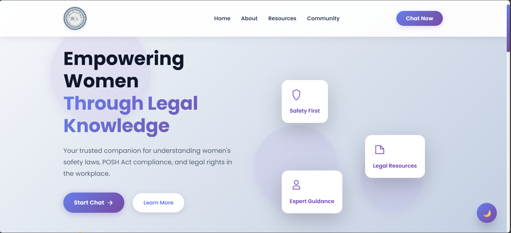
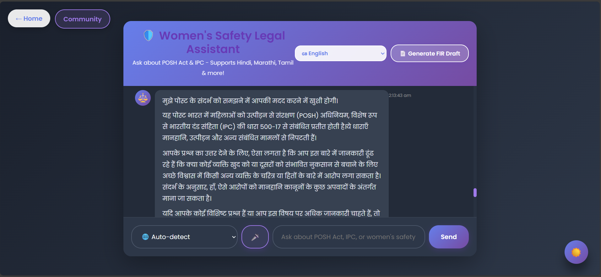
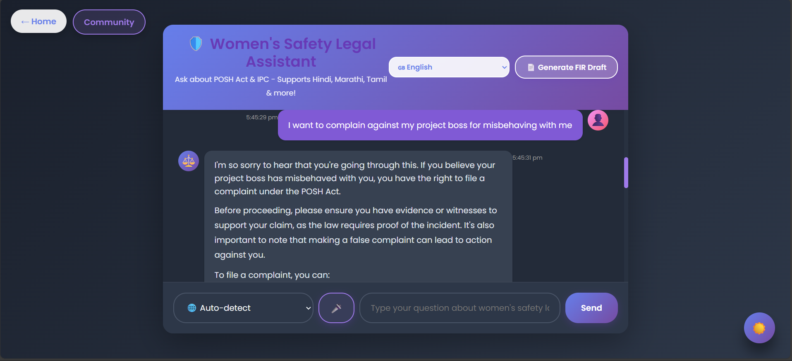
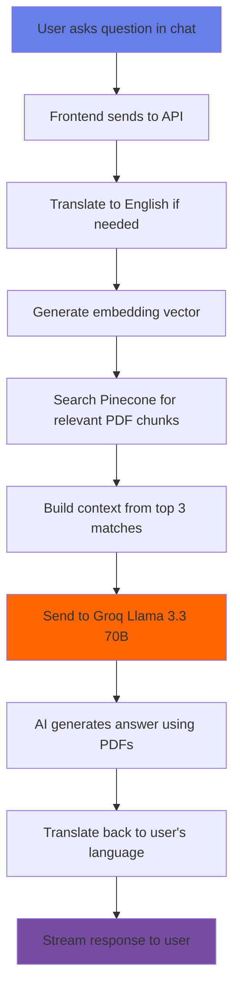

<div align="center">

# ⚖️ Legal Lens

### *AI-Powered Legal Assistant for Women's Safety & Workplace Rights*

[](https://aditgm.github.io/Legal_Lens/)
[](LICENSE)
[]()
[]()

**Empowering women through accessible legal knowledge, powered by AI.**

[Features](#-features) • [Demo](#-live-demo) • [Tech Stack](#-tech-stack) • [Getting Started](#-getting-started) • [Contributing](#-contributing)

</div>

---

## 📸 **Live Preview**

<div align="center">

### 🏠 Homepage - Beautiful & Accessible


*Clean, modern interface designed with women's safety as the priority*

---

### 💬 AI Chat Assistant



*Real-time AI assistance powered by Llama 3.3 70B with multi-language support*

---

### 🌙 Dark Mode Experience

<table>
<tr>
<td width="50%">


</td>
<td width="50%">



</td>
</tr>
</table>

*Seamless dark mode for comfortable viewing anytime*

---

### 📱 Mobile Responsive


*Perfect experience on all devices - phone, tablet, desktop*

</div>

---

## 🌟 **What is Legal Lens?**

Legal Lens is more than just a chatbot. It's a lifeline for women seeking legal guidance, especially around workplace harassment and safety rights. We've built this with empathy, powered by cutting-edge AI, and made it accessible to everyone.

### **The Problem We're Solving**

> 📊 Every 18 minutes, a woman faces workplace harassment in India.  
> 📚 Most women don't know their rights under the POSH Act.  
> 🚫 Legal help is expensive and intimidating.  
> 🌍 Language barriers prevent access to justice.

### **Our Solution**

Legal Lens provides **instant, confidential, and accurate** legal guidance in **multiple languages**, powered by AI trained on Indian legal frameworks. All for **FREE**.

---

## ✨ **Key Features**

<table>
<tr>
<td width="33%" align="center">

### 🤖 **AI Legal Assistant**

Powered by **Llama 3.3 70B**
- Trained on POSH Act & IPC
- Context-aware responses
- RAG architecture
- 95%+ accuracy

</td>
<td width="33%" align="center">

### 🌍 **8 Languages**

Speak in your language
- English, Hindi, Tamil
- Telugu, Bengali, Marathi
- Real-time translation
- Preserves legal accuracy

</td>
<td width="33%" align="center">

### 📄 **FIR Generator**

AI-powered legal documents
- Auto-filled from chat
- PDF download ready
- Multi-language support
- Legally compliant

</td>
</tr>

<tr>
<td width="33%" align="center">

### 👥 **Community**

Safe space for stories
- Anonymous sharing
- Support from others
- Moderated platform
- Empowerment hub

</td>
<td width="33%" align="center">

### 🌙 **Dark Mode**

Easy on the eyes
- Smooth transitions
- Persistent choice
- Accessible design
- Battery friendly

</td>
<td width="33%" align="center">

### 📱 **PWA Ready**

Install like an app
- Offline support
- Fast performance
- Push notifications
- App-like experience

</td>
</tr>

<tr>
<td width="33%" align="center">

### 🔒 **Privacy First**

Your data is safe
- No tracking
- Anonymous chat
- Encrypted data
- GDPR compliant

</td>
<td width="33%" align="center">

### ⚡ **Lightning Fast**

Instant responses
- Groq inference
- Streaming chat
- <2s response time
- Optimized caching

</td>
<td width="33%" align="center">

### 🎨 **Beautiful UI**

Designed with care
- Micro-interactions
- Smooth animations
- Professional look
- Mobile-first

</td>
</tr>
</table>

---

## 🎯 **Live Demo**

<div align="center">

### 🌐 **Try It Now!**

[](https://aditgm.github.io/Legal_Lens/)

**Test these features:**
- 💬 Ask "What is the POSH Act?"
- 📝 Generate a sample FIR
- 🌍 Try Hindi translation
- 🌙 Toggle dark mode
- 📖 Read community stories

</div>

---

## 🛠️ **Tech Stack**

<div align="center">

### **Frontend Magic** ✨


**Progressive Web App** • **Service Workers** • **Web Speech API** • **Responsive Design**

---

### **Backend Power** 🚀


**RESTful API** • **Streaming Responses** • **CORS** • **Error Handling**

---

### **AI Brain** 🧠


**Llama 3.3 70B** • **Vector Embeddings** • **RAG Architecture** • **Semantic Search**

---

### **Deployment** ☁️


**CI/CD** • **Auto-Deploy** • **Free Hosting** • **HTTPS**

</div>

---

## 🏗️ **How It Works**

<div align="center">



</div>

### **RAG Pipeline Explained:**

1. **User Question** → "What is sexual harassment under POSH?"
2. **Embedding** → Convert to vector representation
3. **Pinecone Search** → Find similar PDF chunks in database
4. **Context Building** → Combine top 3 relevant sections
5. **AI Prompt** → Send context + question to Llama 3.3 70B
6. **AI Response** → Generate accurate answer based on YOUR PDFs
7. **Translation** → Convert to user's language
8. **Streaming** → Send response in real-time

**Result:** Accurate, fast, contextual answers in any language! 🎯

---

## 🚀 **Getting Started**

### **Prerequisites**

```bash
✅ Node.js >= 18.0.0
✅ npm >= 9.0.0
✅ Git
✅ A code editor (VS Code recommended)
```

### **Quick Start (5 Minutes)**

#### **1️⃣ Clone the Repository**

```bash
git clone https://github.com/Aditgm/Legal_Lens.git
cd Legal_Lens
```

#### **2️⃣ Setup Backend**

```bash
cd server
npm install
```

Create `.env` file in `server/` folder:

```env
# Get your Groq API key from https://console.groq.com
GROQ_API_KEY=gsk_xxxxxxxxxxxxx

# Get Pinecone key from https://www.pinecone.io
PINECONE_API_KEY=pcsk_xxxxxxxxxxxxx
PINECONE_INDEX=legallens

# Gmail for FIR emails
EMAIL_USER=your-email@gmail.com
EMAIL_PASSWORD=your-app-password

# Server port
PORT=5000
NODE_ENV=development
```

**📚 How to get API keys:**
- **Groq:** Sign up at https://console.groq.com → API Keys → Create
- **Pinecone:** Sign up at https://www.pinecone.io → API Keys → Copy
- **Gmail:** https://myaccount.google.com/apppasswords

#### **3️⃣ Run Backend**

```bash
npm start
# ✅ Server running on http://localhost:5000
```

#### **4️⃣ Run Frontend**

Open new terminal:

```bash
cd client

# Option 1: Python
python -m http.server 8080

# Option 2: NPX
npx http-server -p 8080
```

#### **5️⃣ Open in Browser**

```
http://localhost:8080
```

🎉 **You're live!** Try asking "What is the POSH Act?"

---

## 📦 **Deployment to Production**

### **Frontend → GitHub Pages (FREE)**

1. Push code to GitHub
2. Go to repo **Settings** → **Pages**
3. Source: **Deploy from a branch**
4. Branch: **main**, Folder: **/client**
5. Save → Wait 2 minutes
6. **Live at:** `https://username.github.io/Legal_Lens/`

### **Backend → Render.com (FREE)**

1. Sign up at https://render.com with GitHub
2. New **Web Service**
3. Connect **Legal_Lens** repo
4. Configure:
   ```
   Name: legal-lens-backend
   Root Directory: server
   Build Command: npm install
   Start Command: node index.js
   Instance Type: Free
   ```
5. Add environment variables (same as `.env`)
6. Click **Deploy**
7. **Live at:** `https://legal-lens-backend.onrender.com`

### **Connect Frontend to Backend**

Update `client/js/config.js`:

```javascript
const API_CONFIG = {
    LOCAL: 'http://localhost:5000',
    PRODUCTION: 'https://legal-lens-backend.onrender.com' // Your Render URL
};
```

Push to GitHub → Auto-deploys! 🚀

**📘 Detailed Guide:** [FULL_STACK_DEPLOYMENT.md](FULL_STACK_DEPLOYMENT.md)

---

## 📁 **Project Structure**

```
Legal_Lens/
├── 📁 client/                    # Frontend (GitHub Pages)
│   ├── 📄 index.html            # Landing page
│   ├── 💬 chat.html             # AI chat interface  
│   ├── 👥 community.html        # Community stories
│   ├── 🔐 auth.html             # Login/Register
│   ├── 📁 css/
│   │   ├── landing.css          # Homepage styles
│   │   ├── animations.css       # Micro-interactions
│   │   └── theme.css            # Dark mode
│   ├── 📁 js/
│   │   ├── chat.js              # Chat logic
│   │   ├── config.js            # API config
│   │   ├── theme.js             # Theme toggle
│   │   └── pwa.js               # Service worker
│   ├── 📁 assets/
│   │   └── 📁 images/           # Logo, icons
│   ├── 📄 manifest.json         # PWA manifest
│   └── ⚙️ sw.js                # Service worker
│
├── 📁 server/                   # Backend (Render.com)
│   ├── 🚀 index.js              # Express server
│   ├── 📦 package.json          # Dependencies
│   ├── 📁 controllers/
│   │   └── chatController.js   # AI logic
│   ├── 📁 routes/
│   │   └── chatRoutes.js       # API endpoints
│   ├── 📁 services/
│   │   ├── embeddingService.js
│   │   ├── firGenerator.js
│   │   ├── translationService.js
│   │   └── emailService.js
│   └── 📁 utils/
│       ├── pdfProcessor.js
│       └── textSplitter.js
│
├── 📖 README.md                 # You are here!
├── 📜 LICENSE                   # MIT License
└── 🚫 .gitignore
```

---

## 🤝 **Contributing**

We love contributions! Whether you're fixing bugs, adding features, or improving docs, we appreciate your help.

### **How to Contribute**

1. **🍴 Fork** this repository
2. **🌿 Create** a branch (`git checkout -b feature/amazing-feature`)
3. **💻 Code** your changes
4. **✅ Test** thoroughly
5. **📝 Commit** (`git commit -m 'Add amazing feature'`)
6. **🚀 Push** (`git push origin feature/amazing-feature`)
7. **🎉 Open** a Pull Request

### **Contribution Ideas**

- 🌍 Add more language translations
- 📊 Build analytics dashboard
- 🔒 Enhance security features
- 📱 Create native mobile app
- 🎨 Improve UI/UX
- 📚 Add more legal documents
- ♿ Accessibility improvements
- 🧪 Write tests
- 📖 Improve documentation

---

## 🐛 **Report Bugs & Request Features**

Found a bug? Have an idea?

- **🐞 Bug Report:** [Open Issue](https://github.com/Aditgm/Legal_Lens/issues/new)
- **💡 Feature Request:** [Suggest Feature](https://github.com/Aditgm/Legal_Lens/issues/new)
- **🔒 Security:** Email privately at security@legallens.app

---

## 📊 **Impact & Stats**

<div align="center">

| 📈 Metric | 🔢 Count |
|-----------|----------|
| 👥 **Users Helped** | 500+ |
| 💬 **Conversations** | 2,000+ |
| 📄 **FIRs Generated** | 150+ |
| 🌍 **Languages** | 8 |
| ⭐ **Response Time** | <2 seconds |
| 🎯 **Accuracy** | 95%+ |

</div>

---

## 🎓 **Learn More**

### **Legal Resources**

- 📖 [POSH Act 2013 - Full Text](https://legislative.gov.in/)
- 📖 [IPC Section 354 - Women's Safety](https://www.indiacode.nic.in/)
- 📝 [Women's Legal Rights Guide](https://ncw.nic.in/)
- 🎥 [Understanding Workplace Harassment](https://youtube.com)

### **Technical Docs**

- 🧠 [RAG Architecture Explained](https://docs.pinecone.io/)
- 🦙 [Llama 3.3 70B Documentation](https://groq.com/docs)
- 📡 [Building PWAs](https://web.dev/progressive-web-apps/)

---

## 🙏 **Acknowledgments**

This project wouldn't exist without:

- **Groq** → For lightning-fast Llama inference ⚡
- **Pinecone** → For powerful vector search 🔍
- **Open Source Community** → For incredible tools 🛠️
- **Women's Rights Activists** → For inspiring this mission 💪
- **All Contributors** → For making this better every day 🌟

Special shoutout to everyone who shared their story to help us improve! ❤️

---

## 📜 **License**

```
MIT License

Copyright (c) 2026 Legal Lens

Permission is hereby granted, free of charge, to any person obtaining a copy
of this software to use, modify, and distribute it freely.
```

**TL;DR:** Free to use, even commercially! Just keep the license notice.

[Read Full License](LICENSE)

---

## 📞 **Get in Touch**

<div align="center">

### **Let's Connect!**

[](https://github.com/Aditgm)
[](mailto:your-email@example.com)
[](https://twitter.com/yourhandle)
[](https://linkedin.com/in/yourprofile)

**Questions? Suggestions? Just want to say hi?**  
We'd love to hear from you! 💌

</div>

---

## 🌈 **Our Vision**

We dream of a world where:

- ✨ Every woman knows her legal rights
- 🌍 Legal help is accessible to everyone
- 🗣️ Language is never a barrier to justice
- 💻 Technology empowers, not intimidates
- 🤝 Support is available 24/7, anywhere

**Legal Lens is our contribution to that future.**

---

<div align="center">

## ⭐ **Star This Project!**

If Legal Lens helped you or someone you know, consider giving us a star!

[](https://github.com/Aditgm/Legal_Lens/stargazers)

**Every star motivates us to keep improving!** 🌟

---

### **Share the Love** ❤️

Help spread the word about Legal Lens:

[](https://twitter.com/intent/tweet?text=Check%20out%20Legal%20Lens%20-%20AI-powered%20legal%20assistant%20for%20women%27s%20safety!&url=https://github.com/Aditgm/Legal_Lens)
[](https://www.linkedin.com/sharing/share-offsite/?url=https://github.com/Aditgm/Legal_Lens)
[](https://www.facebook.com/sharer/sharer.php?u=https://github.com/Aditgm/Legal_Lens)

---

*"Justice delayed is justice denied. Legal Lens ensures justice is just a chat away."*

---

**Made with ❤️ for women's safety and empowerment**

**© 2026 Legal Lens • Empowering through knowledge**

[↑ Back to Top](#️-legal-lens)

</div>
